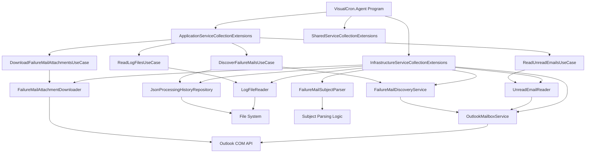
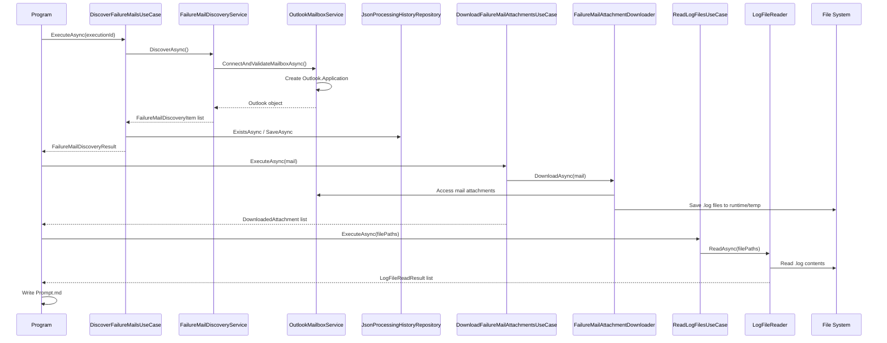

# 01_ARCHITECTURE.md

## Purpose

This document captures the current architecture of the VisualCron AI L1 Support Agent as implemented in the repository today. It is based on the actual source files and runtime behavior present in the workspace, not on an idealized future state.

---

## 1. High-level summary

The project is a .NET 8 Windows console application that:

- connects to Outlook
- discovers failure-related emails in the inbox
- downloads attached log files
- reads those files
- generates a prompt file for downstream AI processing
- persists processing history in JSON files

The solution is organized as a layered architecture with a thin entry-point shell and infrastructure adapters for Outlook and file operations.

---

## 2. Folder structure

```text
VisualCron-AI-L1-Agent/
├── Directory.Build.props
├── global.json
├── README.md
├── RunCopilot.ps1
├── VisualCron-AI-L1-Agent.sln
├── docs/
│   └── AI_CONTEXT/
│       ├── 00_PROJECT_OVERVIEW.md
│       ├── 01_CURRENT_STATUS.md
│       ├── 02_ARCHITECTURE.md
│       ├── 03_PRODUCT_BACKLOG.md
│       ├── 04_NEXT_TASK.md
│       ├── 05_PROMPT_RULES.md
│       ├── AI_HANDOVER.md
│       ├── CHANGE_REQUESTS.md
│       ├── MASTER_PROJECT_STATUS.md
│       └── PROJECT_MEMORY.md
├── runtime/
│   ├── archive/
│   ├── logs/
│   ├── output/
│   ├── prompts/
│   ├── reports/
│   └── temp/
├── scripts/
├── src/
│   ├── VisualCron.Agent/
│   │   ├── Program.cs
│   │   ├── appsettings.json
│   │   ├── appsettings.Development.json
│   │   ├── VisualCron.Agent.csproj
│   │   └── Extensions/
│   │       ├── ApplicationServiceCollectionExtensions.cs
│   │       ├── InfrastructureServiceCollectionExtensions.cs
│   │       └── SharedServiceCollectionExtensions.cs
│   ├── VisualCron.AI.L1.Agent/
│   │   ├── Program.cs
│   │   └── VisualCron.AI.L1.Agent.csproj
│   ├── VisualCron.Application/
│   │   ├── Class1.cs
│   │   └── Outlook/
│   ├── VisualCron.Domain/
│   │   └── Class1.cs
│   ├── VisualCron.Infrastructure/
│   │   ├── Class1.cs
│   │   └── Outlook/
│   ├── VisualCron.Shared/
│   │   └── Class1.cs
│   └── VisualCron.Tests/
│       ├── FailureMailAttachmentDownloaderTests.cs
│       ├── FailureMailDiscoveryUseCaseTests.cs
│       ├── FailureMailSubjectParserTests.cs
│       ├── LogFileReaderTests.cs
│       ├── UnitTest1.cs
│       └── VisualCron.Tests.csproj
└── tools/
```

---

## 3. Layered architecture

### Presentation / entry-point layer

Project: VisualCron.Agent

Responsibilities:
- bootstrap the host
- configure services
- run the workflow once per execution
- log to the console

### Application layer

Project: VisualCron.Application

Responsibilities:
- define use cases such as discovery, attachment download, unread email reading, and log file reading
- own orchestration rules for the workflow
- define interfaces for infrastructure services
- define DTOs and result types

### Infrastructure layer

Project: VisualCron.Infrastructure

Responsibilities:
- connect to Outlook through COM automation
- read inbox contents
- download attachments
- read log files from disk
- persist processing history as JSON
- parse failure mail subjects

### Domain layer

Project: VisualCron.Domain

Responsibilities:
- currently placeholder-oriented
- intended for future business rules and domain entities

### Shared layer

Project: VisualCron.Shared

Responsibilities:
- currently placeholder-oriented
- intended for cross-cutting utilities later

---

## 4. Project responsibilities

### VisualCron.Agent

- acts as the runtime shell
- wires dependencies through Microsoft.Extensions.Hosting
- loads configuration from appsettings files and environment variables
- executes the current workflow end-to-end

### VisualCron.Application

- contains the use-case boundary between orchestration and infrastructure
- keeps the entry point from depending directly on Outlook or file-system specifics
- provides typed models for mail discovery and file reads

### VisualCron.Infrastructure

- contains all concrete integrations with external systems
- handles Outlook COM interop and file IO
- is the only layer that knows how to persist history and save attachments

### VisualCron.AI.L1.Agent

- currently a stub project for a future enterprise AI implementation
- not active in the current execution path

### VisualCron.Tests

- holds unit tests for parsing, discovery, log reading, and attachment downloading

---

## 5. Dependency graph



---

## 6. Class interaction

The main runtime flow is:

```text
Program.cs
  -> Host builder
  -> DI container
  -> DiscoverFailureMailsUseCase
       -> FailureMailDiscoveryService
            -> OutlookMailboxService
                 -> Outlook COM API
       -> JsonProcessingHistoryRepository
  -> DownloadFailureMailAttachmentsUseCase
       -> FailureMailAttachmentDownloader
            -> Outlook COM API
  -> ReadLogFilesUseCase
       -> LogFileReader
            -> File System
  -> FailureMailSubjectParser
       -> parse subject metadata
  -> writes Prompt.md
```

### Runtime object relationships

- Program depends on use cases and infrastructure services via dependency injection.
- Use cases depend on interfaces, not implementations.
- Infrastructure services depend on concrete IO and external dependencies.
- Persisted state is recorded through a repository interface implemented by JSON storage.

---

## 7. Current runtime flow



### Runtime steps

1. The host starts and loads configuration.
2. The entry point resolves the parsing service and use cases.
3. It parses a sample subject to validate the parser.
4. It discovers mails using the failure-mail discovery use case.
5. It filters out already processed emails using JSON history.
6. It downloads attachments from new mails.
7. It reads attached log files.
8. It generates a Prompt.md file next to the log file.
9. It logs the workflow to the console and shuts down.

---

## 8. Outlook flow

```text
OutlookMailboxService
  -> Type.GetTypeFromProgID("Outlook.Application")
  -> create Outlook application instance
  -> validate configured mailbox name
  -> open MAPI namespace
  -> check default Inbox folder
  -> return Outlook object
```

### Outlook responsibilities

- mailbox validation is done before any email operations
- the configured mailbox is read from configuration
- inbox access uses the Outlook MAPI namespace and default folder 6
- mail discovery filters by the configured subject prefix
- attachments are saved to a runtime temp folder

---

## 9. AI flow

The current implementation does not call a live AI provider. Instead, it prepares structured prompt content for downstream AI use.

```text
Failure mail subject
  -> parser extracts job/environment/server
  -> log content is loaded
  -> Prompt.md is generated
  -> prompt is ready for Copilot / AI processing
```

### Current AI-related behavior

- the subject parser extracts metadata
- the prompt file includes incident details and log content
- the prompt content is explicitly framed as an L3 support response request
- the AI provider itself is currently a placeholder in configuration

### Future AI direction

The intended future flow is:

1. create or update a prompt file
2. invoke the AI runtime or Copilot workflow
3. capture AI output into runtime/output
4. store final results with incident metadata

---

## 10. Logging flow

Logging is currently console-based.

```text
Program.cs
  -> ConfigureLogging()
  -> AddSimpleConsole()
  -> all services emit logs through ILogger<T>
```

### Logging responsibilities

- entry-point logs workflow progress
- use cases log discovery and processing counts
- infrastructure services log Outlook connection events, file operations, and parsing results
- exceptions are logged with context and rethrown when appropriate

### Current logging characteristics

- no file logger is configured in the current build
- logs are emitted to the console only
- runtime logs are expected to be redirected or captured externally

---

## 11. Configuration flow

Configuration is loaded by the host builder in the entry point.

```text
Host.CreateDefaultBuilder(args)
  -> UseContentRoot(AppContext.BaseDirectory)
  -> ConfigureAppConfiguration()
       -> appsettings.json
       -> appsettings.{Environment}.json
       -> environment variables
  -> ConfigureServices()
       -> AddApplicationLayer()
       -> AddInfrastructureLayer(configuration)
       -> AddSharedLayer()
```

### Configuration responsibilities

- Outlook settings are bound into OutlookOptions
- infrastructure services receive configuration through options patterns
- the current project relies on appsettings files copied next to the output directory

### Important configuration inputs

- Outlook mailbox name
- maximum emails to scan
- failure mail subject prefix
- future AI provider settings
- future runtime workspace path

---

## 12. Current architectural strengths

- clear separation between application and infrastructure concerns
- interface-driven dependency injection
- straightforward flow for mail discovery and log analysis
- easy extension point for future AI or Copilot execution

## 13. Current architectural gaps

- AI provider integration is not implemented
- the AI L1 agent project is still a stub
- runtime paths are partially hardcoded
- deployment is not yet fully isolated from the host environment
- only console logging is present
