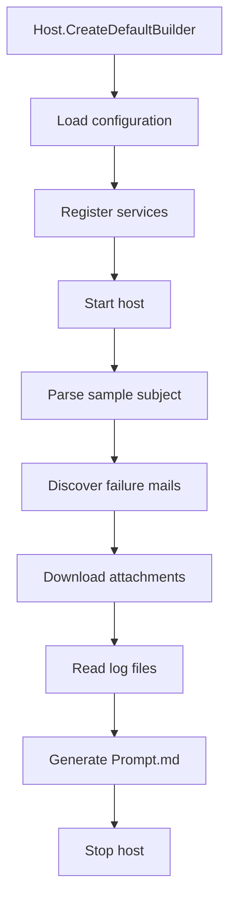
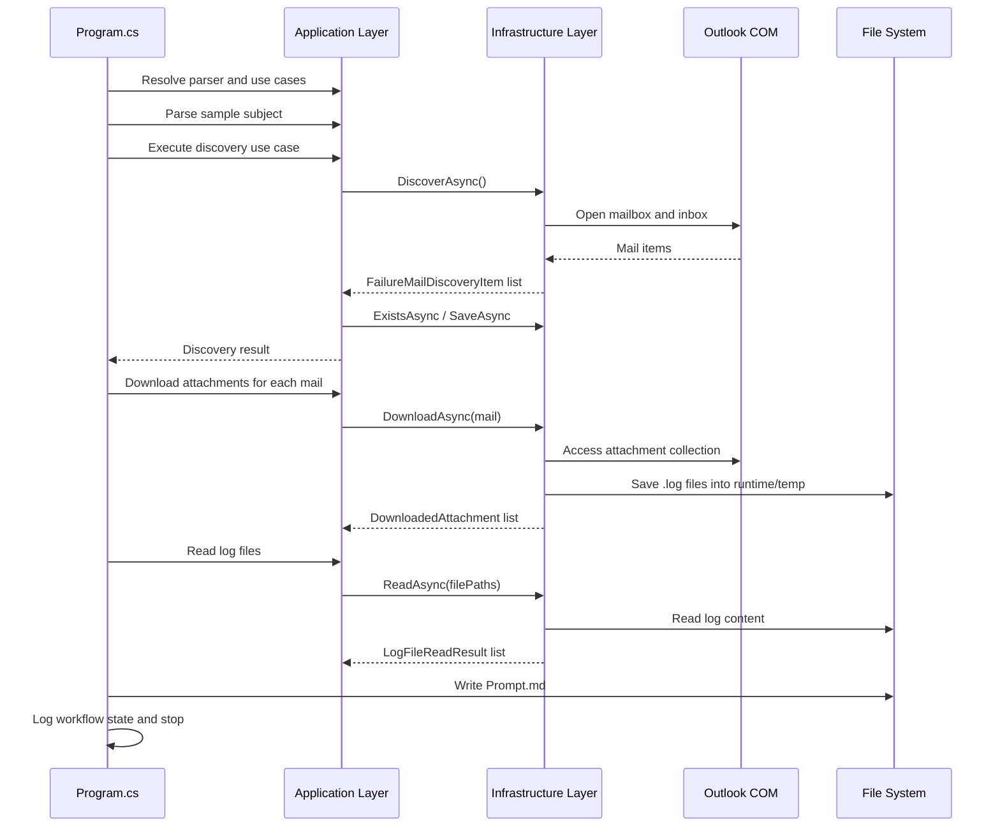

# 02_RUNTIME_FLOW.md

## Purpose

This document describes the current execution path of the application from startup to output generation. It is intentionally based on the current code rather than on a future design.

---

## 1. Entry point

The runtime begins in Program.cs inside the VisualCron.Agent project.

```text
Program.cs
  -> create host
  -> configure services
  -> start host
  -> run workflow
  -> stop host
```

### Program.cs flow



---

## 2. Full execution sequence

```text
Program.cs
  ↓
Host builder initializes dependency injection
  ↓
IFailureMailSubjectParser parses a sample subject
  ↓
DiscoverFailureMailsUseCase executes
  ↓
IFailureMailDiscoveryService discovers mails from Outlook inbox
  ↓
IProcessingHistoryRepository checks whether the mail was already processed
  ↓
New mails are passed forward
  ↓
IDownloadFailureMailAttachmentsUseCase downloads attachments
  ↓
ILogFileReader reads downloaded .log files
  ↓
Prompt.md is written beside the log file
  ↓
Host stops
```

---

## 3. Detailed execution diagram



---

## 4. ASCII flowchart

```text
+----------------------+
|  Program.cs          |
|  - configure host    |
|  - resolve services  |
+----------+-----------+
           |
           v
+----------------------+
|  Subject Parser      |
|  Parse sample subject|
+----------+-----------+
           |
           v
+----------------------+
|  Discover Mails      |
|  Outlook inbox scan  |
+----------+-----------+
           |
           v
+----------------------+
|  History Check       |
|  JSON repository     |
+----------+-----------+
           |
           v
+----------------------+
|  Download Attachments|
|  Save .log files     |
+----------+-----------+
           |
           v
+----------------------+
|  Read Log Files      |
|  return content      |
+----------+-----------+
           |
           v
+----------------------+
|  Generate Prompt.md |
|  write file          |
+----------------------+
           |
           v
+----------------------+
|  Stop Host           |
+----------------------+
```

---

## 5. Execution sequence by class

### Step 1: Program startup

- creates a host
- loads configuration from appsettings and environment variables
- registers application, infrastructure, and shared services

### Step 2: Sample parsing

- Program resolves IFailureMailSubjectParser
- parses a hardcoded example subject
- logs parsed metadata

### Step 3: Failure mail discovery

- Program resolves DiscoverFailureMailsUseCase
- the use case calls IFailureMailDiscoveryService
- the discovery service connects to Outlook and scans inbox items
- items are filtered by configured subject prefix
- processing history is checked and persisted

### Step 4: Attachment download

- Program resolves IDownloadFailureMailAttachmentsUseCase
- the use case calls IFailureMailAttachmentDownloader
- only .log attachments are saved to a runtime temp folder

### Step 5: Log reading

- Program resolves ReadLogFilesUseCase
- the use case calls ILogFileReader
- the reader loads the file contents and returns structured results

### Step 6: Prompt generation

- Program builds a prompt string from incident metadata and log content
- Prompt.md is written to the log-file directory

### Step 7: Shutdown

- the host is stopped after the workflow completes

---

## 6. Outputs produced by the current runtime

### Console output

- startup and configuration logs
- parser validation messages
- discovery counts
- attachment counts
- log file statistics
- prompt generation notices

### Files written to disk

- temporary attachment files under runtime/temp
- processing-history JSON files under runtime/archive/history
- Prompt.md files next to log files

### Data objects returned

- FailureMailDiscoveryResult
- IReadOnlyList<DownloadedAttachment>
- IReadOnlyList<LogFileReadResult>

---

## 7. Current runtime dependencies

```text
Program.cs
  -> Microsoft.Extensions.Hosting
  -> Microsoft.Extensions.Configuration
  -> Microsoft.Extensions.Logging
  -> application use cases
  -> infrastructure implementations
  -> Outlook COM automation
  -> local file system
```
